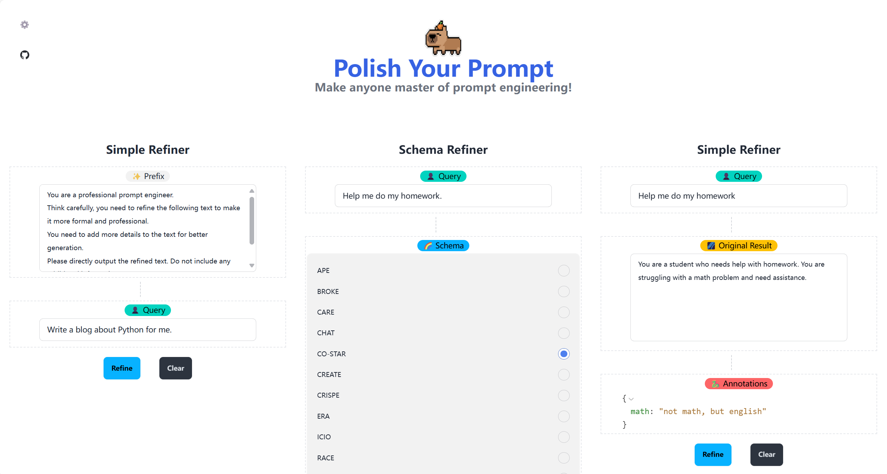
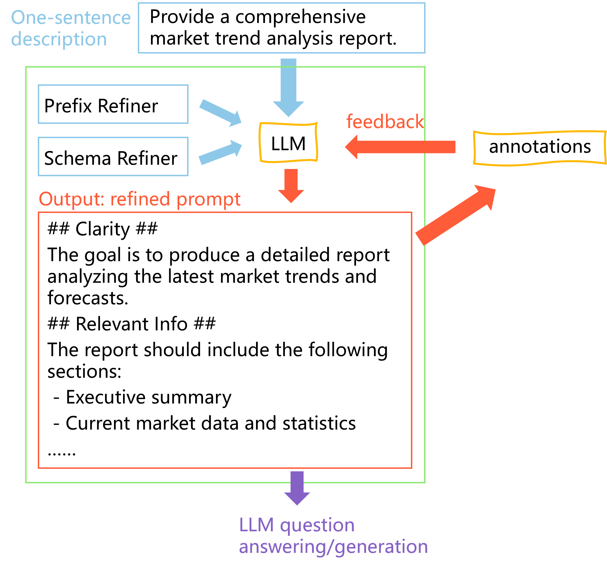

[English](README.md) | [简体中文](README_zh.md)

[![Contributors][contributors-shield]][contributors-url]
[![Forks][forks-shield]][forks-url]
[![Stargazers][stars-shield]][stars-url]
[![Issues][issues-shield]][issues-url]
[![MIT License][license-shield]][license-url]


<!-- PROJECT LOGO -->
<br />
<div align="center">
  <a href="https://github.com/ChenZiHong-Gavin/Polish-Your-Prompt">
    
  </a>

  <h1 align="center">Polish-Your-Prompt</h1>

  <p align="center">
    Make anyone master of prompt engineering!
    <br />
    <br />
    <a href="https://github.com/ChenZiHong-Gavin/Polish-Your-Prompt/tree/main/demo">View Demo</a>
    ·
    <a href="https://polish-your-prompt.vercel.app/">Web UI</a>
    ·
    <a href="https://github.com/ChenZiHong-Gavin/Polish-Your-Prompt/issues/new?labels=bug&template=bug-report---.md">Report Bug</a>
    ·
    <a href="https://github.com/ChenZiHong-Gavin/Polish-Your-Prompt/issues/new?labels=enhancement&template=feature-request---.md">Request Feature</a>
  </p>
</div>



<!-- TABLE OF CONTENTS -->
<details>
  <summary>Table of Contents</summary>
  <ol>
    <li>
      <a href="#about-the-project">About The Project</a>
    </li>
    <li>
      <a href="#getting-started">Getting Started</a>
      <ul>
        <li><a href="#installation">Installation</a></li>
        <li><a href="#configuration">Installation</a></li>
      </ul>
    </li>
    <li><a href="#usage">Usage</a></li>
    <li><a href="#roadmap">Roadmap</a></li>
    <li><a href="#license">License</a></li>
    <li><a href="#acknowledgments">Acknowledgments</a></li>
  </ol>
</details>


<!-- ABOUT THE PROJECT -->
## About The Project



What is the `ENGINEERING` part of `Prompt Engineering`? 

Prompt Engineering is the mix of engineering and art. Some people are very good at writing, and they can talk
to LLMs in a very natural way. However, some may not. 
They need help to create high-quality prompts that can be used to generate satisfactory text.

In this project, we introduced a tool that make you master of prompt engineering and create prompts
that can be reused *the rest of your life*.

The tool provides 3 types of prompt refiner:
1.  **Simple Refiner**: refine your prompt with a simple prefix.
2.  **Schema Refiner**: refine your prompt with a widely used structure, e.g. `COSTAR`, `RISE`.
3.  **Annotated Refiner**: refine your prompt with text annotations.

See the [demos](https://github.com/ChenZiHong-Gavin/Polish-Your-Prompt/tree/main/demo) for more details.


<!-- GETTING STARTED -->
## Getting-started
### Installation

  ```sh
  pip install polish_your_prompt
  ```

### Configuration

Enter your LLM API base and API key in `.env` file (create one if not exist).

  ```sh
  API_BASE="your-api-base"
  API_KEY="your-api-key"
  ```

In theory, any large language model that supports the OpenAI API style can use this tool.


<!-- USAGE EXAMPLES -->
## Usage

Take `SchemaRefiner` as an example:

```python
from polish_your_prompt.core import SchemaRefiner, MODE
from polish_your_prompt.schemas import  *
prompt = "help me do my homework"
refiner = SchemaRefiner()
structure, prompt = refiner.refine(prompt, schema=COSTAR(), mode=MODE.ONE_STEP)
```

CO-STAR is a prompt template proposed by Sheila Teo in Singapore’s first ever "
"GPT-4 Prompt Engineering competition organized by the Government Technology "
"Agency of Singapore (GovTech). 

Check out the [article](https://towardsdatascience.com/how-i-won-singapores-gpt-4-prompt-engineering-competition-34c195a93d41) for more details.

In this way, the LLM will change the prompt into a `CO-STAR` style structure, like:

```markdown
# CONTEXT #
You are a student in high school taking a math class.

# OBJECTIVE #
Seek assistance with completing your homework assignment.

# STYLE #
Informal student seeking help.

# TONE #
Polite and respectful.

# AUDIENCE #
Classmate or tutor who can provide guidance.

# RESPONSE #
Clear explanation of the homework task and request for assistance.\n'

```

In most cases, the LLM will generate a more satisfactory response.

See the [demos](https://github.com/ChenZiHong-Gavin/Polish-Your-Prompt/tree/main/demo) for more details.

See the [schemas](https://github.com/ChenZiHong-Gavin/Polish-Your-Prompt/tree/main/polish_your_prompt/schemas) for more choices.

<!-- ROADMAP -->
## Roadmap

- [x] A web interface for users to interact with the tool
- [ ] Multi-language Support
    - [ ] Chinese
- [ ] A demo interface for non-programmers
- [ ] A choice to give death threats or 10＄ tips to LLM

Willing to contribute? Check out the [open issues](https://github.com/ChenZiHong-Gavin/Polish-Your-Prompt/issues/new?labels=enhancement&template=feature-request---.md).

If you have a suggestion that would make this better, please fork the repo and create a pull request. You can also simply open an issue with the tag "enhancement".

Don't forget to give the project a star! Thanks again!


<!-- LICENSE -->
## License

Distributed under the MIT License. See `LICENSE.txt` for more information.


<!-- ACKNOWLEDGMENTS -->
## Acknowledgments

Projects or articles that inspired this project:

* [CO-STAR](https://towardsdatascience.com/how-i-won-singapores-gpt-4-prompt-engineering-competition-34c195a93d41)
* [Prompt提示词——常见的Prompt框架](https://blog.csdn.net/pumpkin84514/article/details/137474655)
* [RePrompt](https://arxiv.org/abs/2406.11132)


<!-- MARKDOWN LINKS & IMAGES -->
<!-- https://www.markdownguide.org/basic-syntax/#reference-style-links -->
[contributors-shield]: https://img.shields.io/github/contributors/ChenZiHong-Gavin/Polish-Your-Prompt.svg?style=for-the-badge
[contributors-url]: https://github.com/ChenZiHong-Gavin/Polish-Your-Prompt/graphs/contributors
[forks-shield]: https://img.shields.io/github/forks/ChenZiHong-Gavin/Polish-Your-Prompt.svg?style=for-the-badge
[forks-url]: https://github.com/ChenZiHong-Gavin/Polish-Your-Prompt/network/members
[stars-shield]: https://img.shields.io/github/stars/ChenZiHong-Gavin/Polish-Your-Prompt.svg?style=for-the-badge
[stars-url]: https://github.com/ChenZiHong-Gavin/Polish-Your-Prompt/stargazers
[issues-shield]: https://img.shields.io/github/issues/ChenZiHong-Gavin/Polish-Your-Prompt.svg?style=for-the-badge
[issues-url]: https://github.com/ChenZiHong-Gavin/Polish-Your-Prompt/issues
[license-shield]: https://img.shields.io/github/license/ChenZiHong-Gavin/Polish-Your-Prompt.svg?style=for-the-badge
[license-url]: https://github.com/ChenZiHong-Gavin/Polish-Your-Prompt/blob/master/LICENSE.txt
