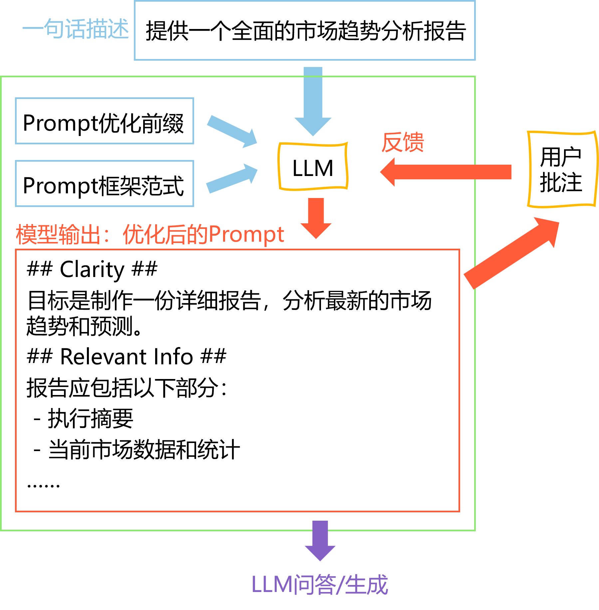

[English](README.md) | [简体中文](README_zh.md)

[![Contributors][contributors-shield]][contributors-url]
[![Forks][forks-shield]][forks-url]
[![Stargazers][stars-shield]][stars-url]
[![Issues][issues-shield]][issues-url]
[![MIT License][license-shield]][license-url]


<!-- PROJECT LOGO -->
<br />
<div align="center">
  <a href="https://github.com/ChenZiHong-Gavin/Polish-Your-Prompt">
    
  </a>

  <h1 align="center">Polish-Your-Prompt</h1>

  <p align="center">
    让所有人成为提示词大师!
    <br />
    <br />
    <a href="https://github.com/ChenZiHong-Gavin/Polish-Your-Prompt/tree/main/demo">查看示例</a>
    ·
    <a href="https://github.com/ChenZiHong-Gavin/Polish-Your-Prompt/issues/new?labels=bug&template=bug-report---.md">报告错误</a>
    ·
    <a href="https://github.com/ChenZiHong-Gavin/Polish-Your-Prompt/issues/new?labels=enhancement&template=feature-request---.md">新功能</a>
  </p>
</div>


<!-- TABLE OF CONTENTS -->
<details>
  <summary>目录</summary>
  <ol>
    <li>
      <a href="#关于项目">关于项目</a>
    </li>
    <li>
      <a href="#快速开始">快速开始</a>
      <ul>
        <li><a href="#安装">安装</a></li>
        <li><a href="#配置">配置</a></li>
      </ul>
    </li>
    <li><a href="#使用">使用</a></li>
    <li><a href="#路线">路线</a></li>
    <li><a href="#许可">许可</a></li>
    <li><a href="#致谢">致谢</a></li>
  </ol>
</details>


<!-- ABOUT THE PROJECT -->
## 关于项目



`提示词工程`中，究竟哪里是`工程`? 

提示工程是工程与艺术的结合。有些人很擅长写提示词，他们能用很自然的方式和大语言模型交流。但是，很多人可能做不到。
他们可能需要额外的帮助来创建高质量的提示词，以用于生成令人满意的文本。

在这个项目中，我们构建了一个工具，能够让你轻松成为提示词大师，创造出可以在*你的余生中*重复使用的提示词。

我们提供了3种类型的提示词优化器：

1.  **Simple Refiner**: 通过简单的前缀优化你的提示词。
2.  **Schema Refiner**: 通过广泛使用的提示词模板来优化你的提示词，例如`COSTAR`, `RISE`.
3.  **Annotated Refiner**: 通过文本批注来优化你的提示词

查看 [示例](https://github.com/ChenZiHong-Gavin/Polish-Your-Prompt/tree/main/demo) 来获取更多细节。


<!-- GETTING STARTED -->
## 快速开始
### 安装

  ```sh
  pip install polish_your_prompt
  ```

### 配置

在 `.env` 文件中，输入你的大模型 API base 和 API key （如果没有这个文件，就创建一个）.

  ```sh
  API_BASE="your-api-base"
  API_KEY="your-api-key"
  ```

理论上，只要大模型支持 OpenAI API 风格，就可以使用这个工具。

<!-- USAGE EXAMPLES -->
## 使用

以 `SchemaRefiner` 为例:

```python
from polish_your_prompt.core import SchemaRefiner, MODE
from polish_your_prompt.schemas import  *
prompt = "help me do my homework"
refiner = SchemaRefiner()
structure, prompt = refiner.refine(prompt, schema=COSTAR(), mode=MODE.ONE_STEP)
```

COSTAR 是由新加坡政府技术局（GovTech）组织的新加坡首届“GPT-4提示词工程”比赛中，
Sheila Teo 提出的一个提示词模板。

查看 [文章](https://towardsdatascience.com/how-i-won-singapores-gpt-4-prompt-engineering-competition-34c195a93d41) 获取更多细节。

LLM会将输入的提示词转换成一个 `COSTAR` 风格的结构，如：


```markdown
# CONTEXT #
You are a student in high school taking a math class.

# OBJECTIVE #
Seek assistance with completing your homework assignment.

# STYLE #
Informal student seeking help.

# TONE #
Polite and respectful.

# AUDIENCE #
Classmate or tutor who can provide guidance.

# RESPONSE #
Clear explanation of the homework task and request for assistance.\n'

```

在大多数情况下，LLM 会生成一个更令人满意的回答。

查看 [示例](https://github.com/ChenZiHong-Gavin/Polish-Your-Prompt/tree/main/demo) 获取更多细节。


<!-- ROADMAP -->
## 路线

- [ ] 多语言支持
    - [ ] 中文
- [ ] 一个给非程序员的网页界面
- [ ] 提供给LLM死亡威胁或10美元小费的选择

想要贡献？查看 [open issues](https://github.com/ChenZiHong-Gavin/Polish-Your-Prompt/issues/new?labels=enhancement&template=feature-request---.md)。

如果你有一个可以让这个项目变得更好的建议，请 fork 这个仓库并创建一个 pull request。
你也可以简单地开启一个带有“enhancement”标签的`ISSUE`。

别忘了给个star！谢谢！


<!-- LICENSE -->
## 许可

MIT License. 查看`LICENSE.txt`。


<!-- ACKNOWLEDGMENTS -->
## 致谢

对本项目有启发的项目或文章：

* [CO-STAR](https://towardsdatascience.com/how-i-won-singapores-gpt-4-prompt-engineering-competition-34c195a93d41)
* [Prompt提示词——常见的Prompt框架](https://blog.csdn.net/pumpkin84514/article/details/137474655)


<!-- MARKDOWN LINKS & IMAGES -->
<!-- https://www.markdownguide.org/basic-syntax/#reference-style-links -->
[contributors-shield]: https://img.shields.io/github/contributors/ChenZiHong-Gavin/Polish-Your-Prompt.svg?style=for-the-badge
[contributors-url]: https://github.com/ChenZiHong-Gavin/Polish-Your-Prompt/graphs/contributors
[forks-shield]: https://img.shields.io/github/forks/ChenZiHong-Gavin/Polish-Your-Prompt.svg?style=for-the-badge
[forks-url]: https://github.com/ChenZiHong-Gavin/Polish-Your-Prompt/network/members
[stars-shield]: https://img.shields.io/github/stars/ChenZiHong-Gavin/Polish-Your-Prompt.svg?style=for-the-badge
[stars-url]: https://github.com/ChenZiHong-Gavin/Polish-Your-Prompt/stargazers
[issues-shield]: https://img.shields.io/github/issues/ChenZiHong-Gavin/Polish-Your-Prompt.svg?style=for-the-badge
[issues-url]: https://github.com/ChenZiHong-Gavin/Polish-Your-Prompt/issues
[license-shield]: https://img.shields.io/github/license/ChenZiHong-Gavin/Polish-Your-Prompt.svg?style=for-the-badge
[license-url]: https://github.com/ChenZiHong-Gavin/Polish-Your-Prompt/blob/master/LICENSE.txt
[product-screenshot]: images/screenshot.png
[Next.js]: https://img.shields.io/badge/next.js-000000?style=for-the-badge&logo=nextdotjs&logoColor=white
[Next-url]: https://nextjs.org/
[React.js]: https://img.shields.io/badge/React-20232A?style=for-the-badge&logo=react&logoColor=61DAFB
[React-url]: https://reactjs.org/
[Vue.js]: https://img.shields.io/badge/Vue.js-35495E?style=for-the-badge&logo=vuedotjs&logoColor=4FC08D
[Vue-url]: https://vuejs.org/
[Angular.io]: https://img.shields.io/badge/Angular-DD0031?style=for-the-badge&logo=angular&logoColor=white
[Angular-url]: https://angular.io/
[Svelte.dev]: https://img.shields.io/badge/Svelte-4A4A55?style=for-the-badge&logo=svelte&logoColor=FF3E00
[Svelte-url]: https://svelte.dev/
[Laravel.com]: https://img.shields.io/badge/Laravel-FF2D20?style=for-the-badge&logo=laravel&logoColor=white
[Laravel-url]: https://laravel.com
[Bootstrap.com]: https://img.shields.io/badge/Bootstrap-563D7C?style=for-the-badge&logo=bootstrap&logoColor=white
[Bootstrap-url]: https://getbootstrap.com
[JQuery.com]: https://img.shields.io/badge/jQuery-0769AD?style=for-the-badge&logo=jquery&logoColor=white
[JQuery-url]: https://jquery.com 